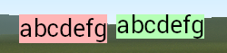
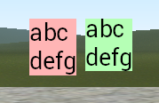

# glua-VisualCharacterHeight
 Adds a function that works out the visual height of the provided character(-s).

 May be very helpful for positioning text by height.
 
 Newlines are supported.

### `GetTextSize` vs `GetVisualCharacterHeight`


```lua
local font = 'DermaLarge'
local char = 'abcdefg'

hook.Add( 'HUDPaint', '', function()

	surface.SetFont( font )
	local w, h = surface.GetTextSize( char )

	local x = ScrW() * 0.5 - w - 5
	local y = ScrH() * 0.5

	surface.SetDrawColor( 255, 180, 180 )
	surface.DrawRect( x, y, w, h )

	draw.SimpleText( char, font, x, y, color_black )

	x = ScrW() * 0.5 + 5

	local visualheight, roofheight = surface.GetVisualCharacterHeight( char, font )

	surface.SetDrawColor( 180, 255, 180 )
	surface.DrawRect( x, y, w, visualheight )

	y = y - roofheight

	draw.SimpleText( char, font, x, y, color_black )

end )
```

#### With newlines


```lua
local font = 'DermaLarge'
local char = 'abc\ndefg'

hook.Add( 'HUDPaint', '', function()

	surface.SetFont( font )
	local w, h = surface.GetTextSize( char )

	local x = ScrW() * 0.5 - w - 5
	local y = ScrH() * 0.5

	surface.SetDrawColor( 255, 180, 180 )
	surface.DrawRect( x, y, w, h )

	draw.DrawText( char, font, x, y, color_black )

	x = ScrW() * 0.5 + 5

	local visualheight, roofheight = surface.GetVisualCharacterHeight( char, font )

	surface.SetDrawColor( 180, 255, 180 )
	surface.DrawRect( x, y, w, visualheight )

	y = y - roofheight

	draw.DrawText( char, font, x, y, color_black )

end )
```
